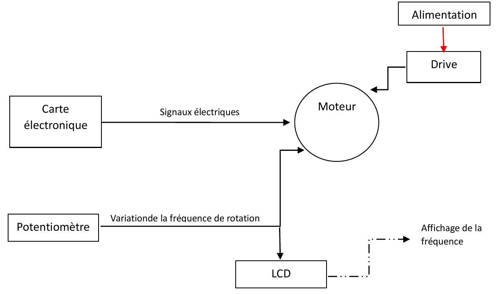
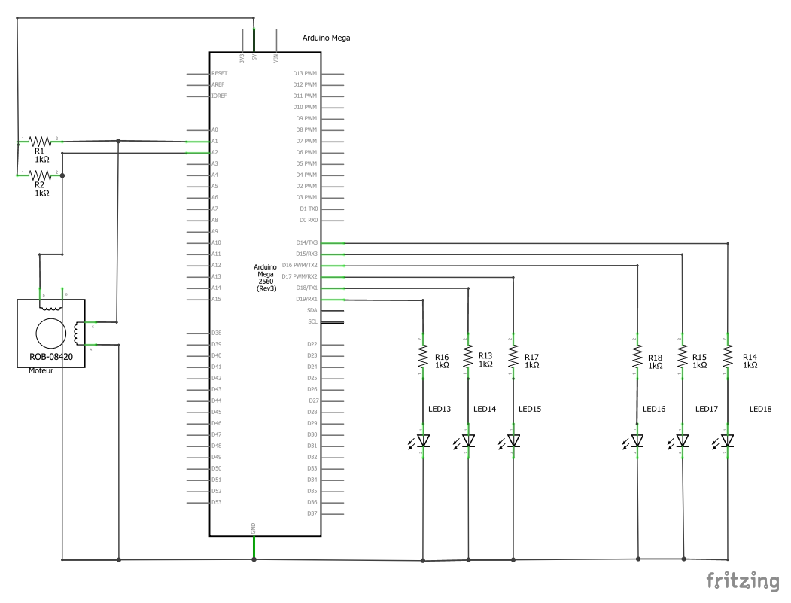
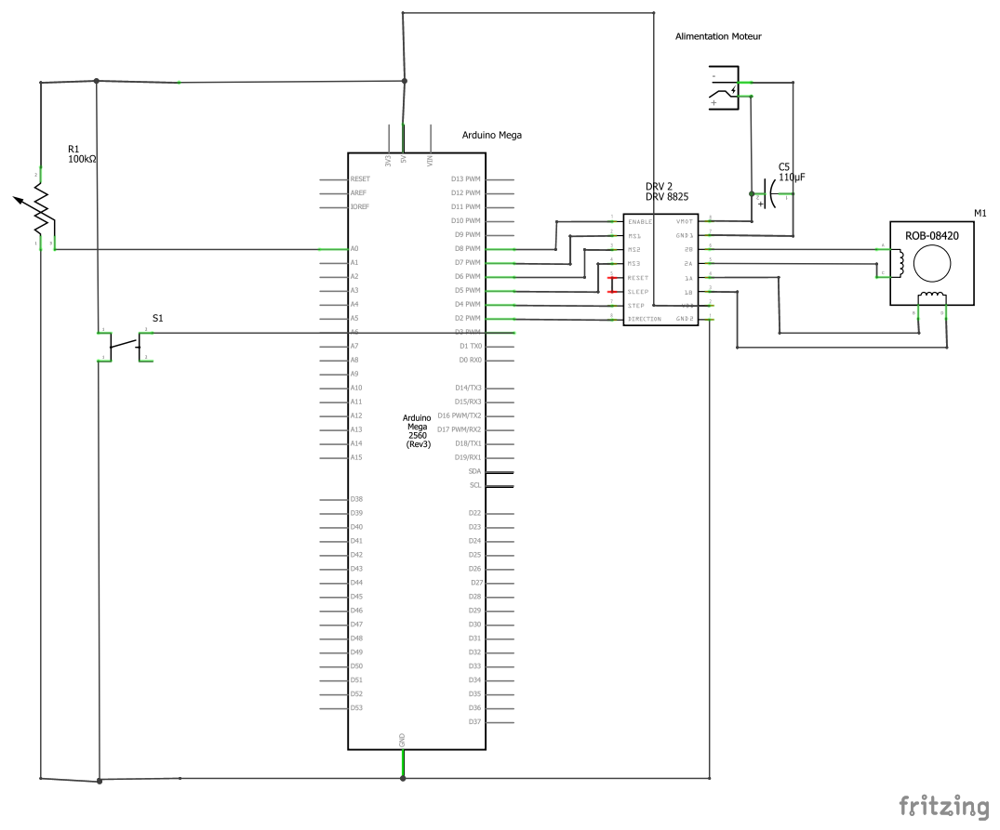

# Prüfstand für Schrittmotoren (Arduino / DRV8825)

Prüfstand zur Funktionsprüfung von Permanentmagnet-Schrittmotoren vor der Auslieferung.
Entwickelt im Rahmen meines Bachelor-Abschlussprojekts (Mechatronik, 2023) in Zusammenarbeit mit einem Hersteller von Industriekomponenten.

**Ziel:** Ein einziger Prüfstand für alle Baugrößen einer Schrittmotor-Produktfamilie – statt eines eigenen Prüfstands pro Motortyp.



## Funktionen

- **Spulenprüfung (Durchgangsprüfung):** Messung des Widerstands beider Motorspulen über Spannungsteiler, Anzeige per LEDs (Spule in Ordnung / Spule unterbrochen)
- **Drehrichtungstest:** Motor dreht auf Knopfdruck eine volle Umdrehung im Uhrzeigersinn und anschließend gegen den Uhrzeigersinn
- **Drehzahlverstellung:** Schrittfrequenz stufenlos per Potentiometer einstellbar
- **Frequenzanzeige:** aktuelle Schrittfrequenz auf einem LCD 16×2

## Geprüfte Motoren

| Parameter | Bereich |
|---|---|
| Durchmesser | 35 – 65 mm |
| Betriebsspannung | 6 – 25 V (teilweise bis 45 V) |
| Strom pro Phase | 0,14 – 1,1 A |
| Schrittwinkel | 7,5° (48 Schritte pro Umdrehung) |
| Bauart | 2-phasig (4 Leitungen) und 4-phasig (6 Leitungen) |

## Hardware

- Arduino Mega 2560
- Schrittmotortreiber DRV8825 (2 H-Brücken, bis 45 V / 2,5 A pro Phase)
- Externes Netzteil für den Motor, 100 µF Stützkondensator am Treibereingang
- LCD 16×2 (HD44780, Bibliothek `LiquidCrystal.h`)
- 10 kΩ Potentiometer (Drehzahl), 10 kΩ Potentiometer (LCD-Kontrast)
- Taster mit Pull-down-Widerstand
- 6 LEDs mit Vorwiderständen
- Referenzwiderstände für die Spannungsteiler

## Funktionsweise

### 1. Spulenprüfung
Jede Spule bildet mit einem bekannten Referenzwiderstand einen Spannungsteiler. Die Mittenspannung wird über einen Analogeingang gemessen:

```
Vs = Ve · R / (R + Rref)   →   R = Rref / (Ve/Vs − 1)
```

Liegt der berechnete Widerstand im gültigen Bereich, leuchten die drei LEDs der jeweiligen Spule. Unendlicher Widerstand = Spule unterbrochen → LEDs bleiben aus.



### 2. Ansteuerung über den DRV8825
- **STEP:** jeder Impuls = ein Schritt; die Impulsfrequenz bestimmt die Drehzahl
- **DIR:** Drehrichtung
- **M0–M2:** Mikroschritt-Modus (hier: Vollschritt)
- **Strombegrenzung:** über das Trimmpotentiometer am Treiber eingestellt, `I_max = 2 · Vref` (z. B. Vref = 0,5 V → 1 A)



### 3. Drehzahl und Anzeige
Der Potentiometerwert (0–1023) wird auf die Schrittperiode abgebildet. Aus der Periode wird die Frequenz berechnet und auf dem LCD angezeigt.

## Code

Der Arduino-Sketch liegt in [`pruefstand/pruefstand.ino`](pruefstand/pruefstand.ino).

## Pinbelegung (Arduino Mega)

| Funktion | Pin |
|---|---|
| Potentiometer (Drehzahl) | A0 |
| Spannungsteiler Spule 1 / Spule 2 | A1 / A2 |
| Taster Start | D2 |
| DRV8825 DIR / STEP | D3 / D4 |
| DRV8825 M2 / M1 / M0 / EN | D5 / D6 / D7 / D8 |
| LEDs Spule 1 | D14 – D16 |
| LEDs Spule 2 | D17 – D19 |
| LCD RS / E / D4–D7 | D22 / D13 / D24–D27 |

## Mögliche Erweiterungen

- Akustisches Signal zusätzlich zu den LEDs
- Anzeige des gemessenen Spulenwiderstands auf dem Display (Soll/Ist-Vergleich)
- Automatischer Prüfablauf mit Protokollierung der Ergebnisse (z. B. über die serielle Schnittstelle)

## Verwendete Werkzeuge

Arduino IDE (C/C++), Fritzing (Schaltpläne), Multimeter
